# Gadget-Bit: Online Laptop Store

## Admin Functionality

### Categories Management

- Admin users can create categories for organizing products.
- Each category includes a name and description.

### Product Management

- Admin users can upload products and associate them with categories.
- Product details include name, description, price, and category association.

## User Functionality

### Authentication

- Utilizes the Devise gem for user authentication.
- Customers must be logged in to access certain functionalities.

### Cart Management

- Users must be signed in to add items to the cart.
- Each user has their own cart.
- Cart items include product details and quantity.

### Order Placement

- Users can place orders.
- Orders include details such as total amount, order date, and fulfillment status.
- After order placement, order details are sent via Gmail to both the admin and the customer.

### Email Notifications

- Order details are mailed using Gmail to both admin and customer emails.
- Sidekiq gem is used for sending emails asynchronously, ensuring efficient processing.

### Pagination

- Utilizes the Pagi gem for pagination to enhance user experience by dividing large data sets into smaller, more manageable pages.

## Database Schema Overview

The project utilizes the following database tables:

- **Active Storage**: Manages file attachments.
- **Cart Items**: Stores items added to the cart, including quantity and associated product.
- **Carts**: Tracks user-specific carts.
- **Categories**: Stores product categories with name and description.
- **Order Addresses**: Contains shipping addresses for orders.
- **Order Products**: Represents the products included in each order, along with quantity.
- **Orders**: Stores order details, including total amount and fulfillment status.
- **Products**: Holds information about available products, including name, description, price, and category association.
- **Stocks**: Manages product stock levels.
- **Users**: Stores user information, including email, password, contact, and name.

## Additional Notes

- The project leverages the capabilities of the Devise gem for user authentication, ensuring secure access to user-specific functionalities.
- Email notifications for order details are handled asynchronously using Sidekiq, enhancing system performance and responsiveness.
- Pagination enhances user experience by breaking down large data sets into smaller, more manageable pages, improving navigation efficiency.

---

# Application ScreenShots !

## Unregistered user browsing for laptop

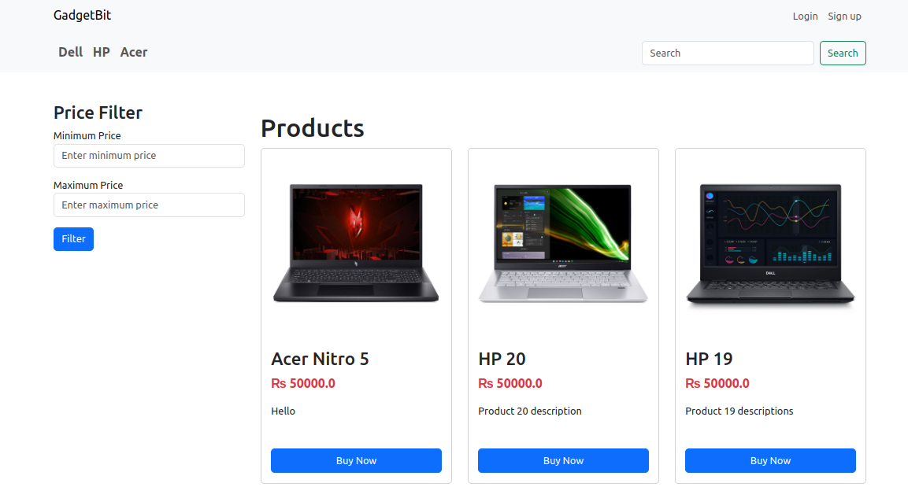

**User must be registered to order products**

## User login form

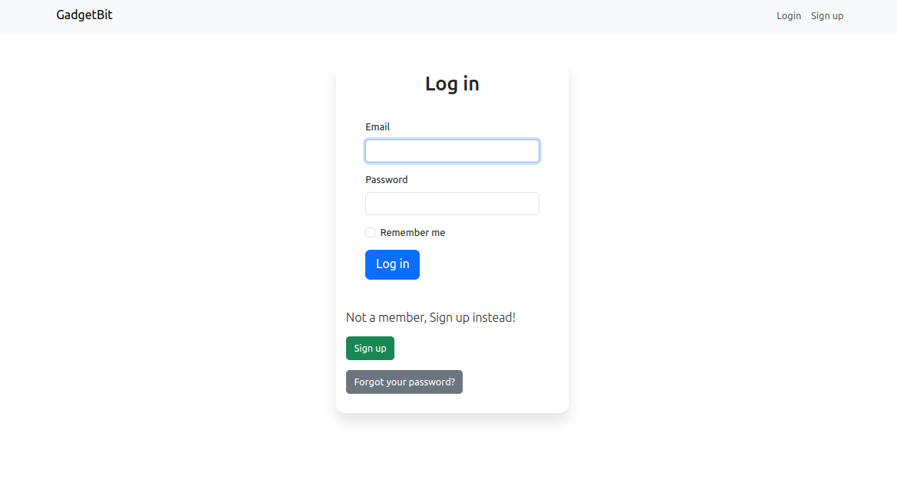

## User sign up form

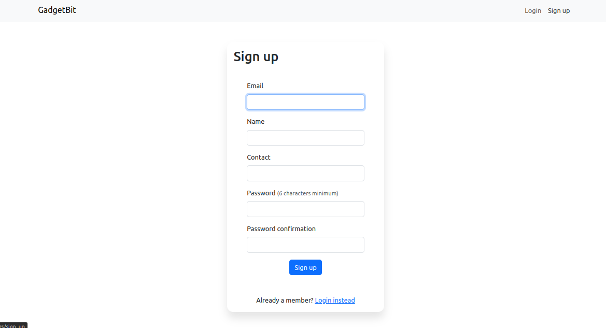

## User sing up form : Client side validation

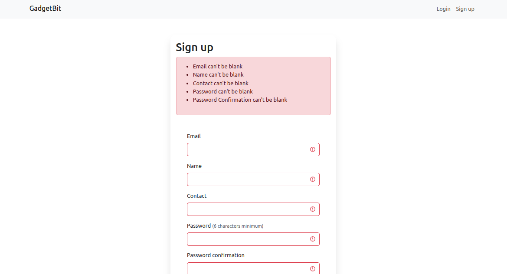

## Registered user browsing for laptop

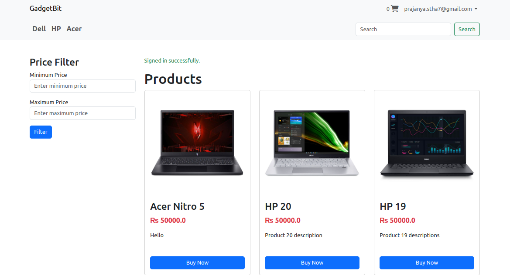

## Registered user viewing laptop details

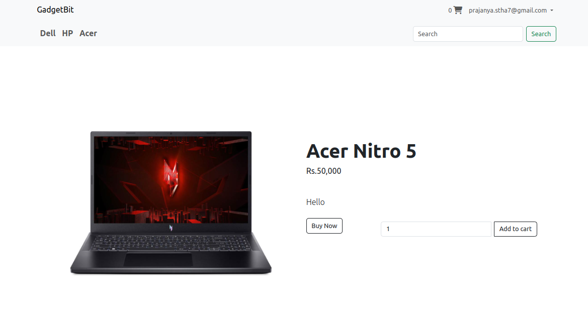

## Registered user cart

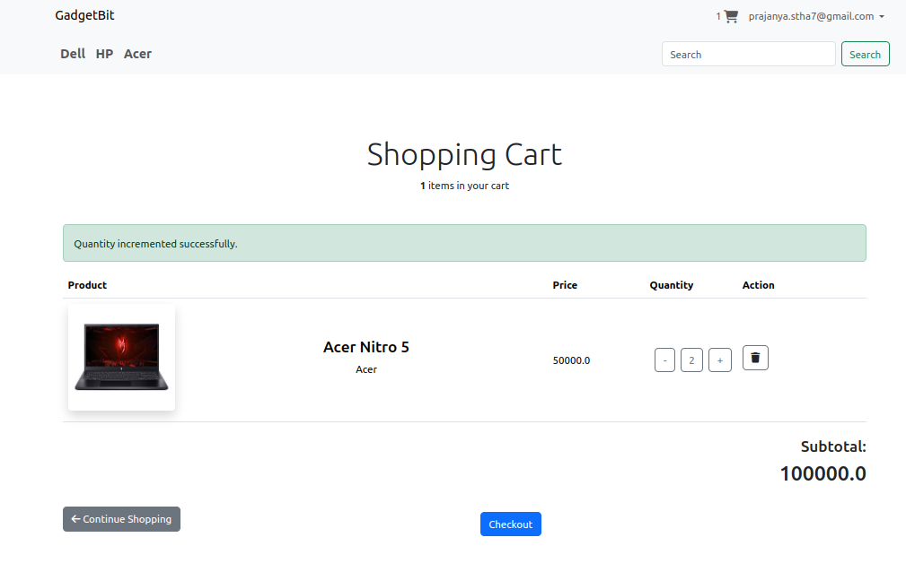

## Checkout form

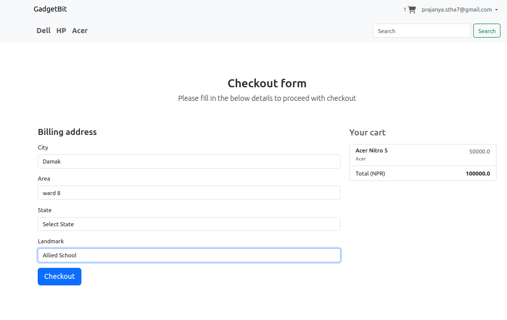

## Admin viewing all orders

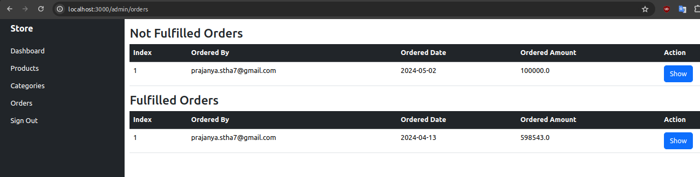

## Admin viewing each order

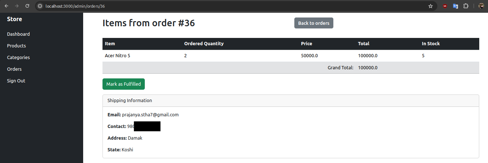

## Admin dispatching the order

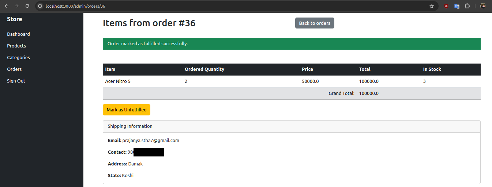

## Admin dashboard

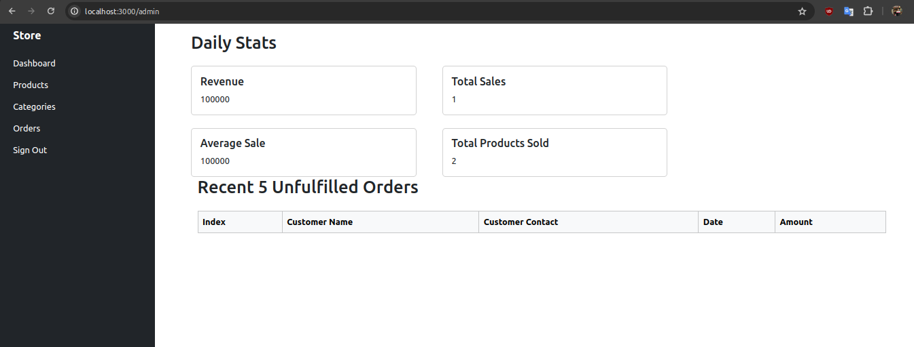

## Admin editing product

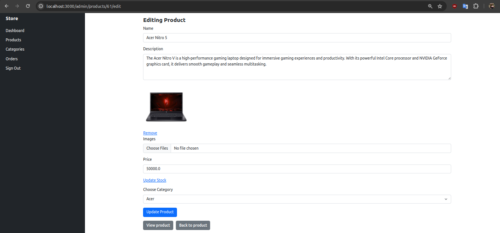
